# Strategic Growth Plan for World Detail Specialist

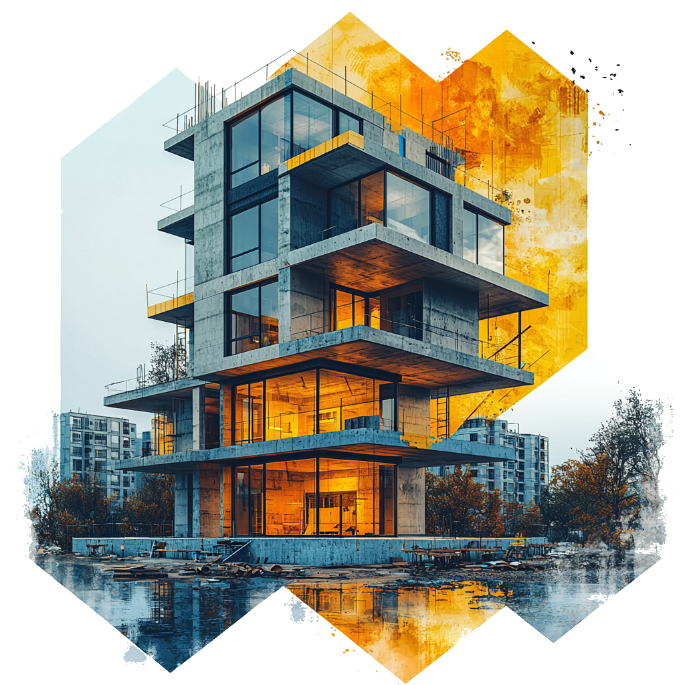
 

## Executive Summary

World Detail Specialist is poised for significant growth in the competitive Miami construction and remodeling market. This comprehensive plan outlines a strategic approach to digital transformation, brand development, and operational excellence that will support your ambitious vision: _"Not stopping until we've built the first house on the moon."_

This document provides a roadmap to achieve your growth objectives:

- **Short-term (1 Year):** Increase project volume by 50%, establish digital dominance
- **Mid-term (3 Years):** Expand across South Florida, secure larger commercial contracts
- **Long-term (5+ Years):** Develop into a full-service construction and development company

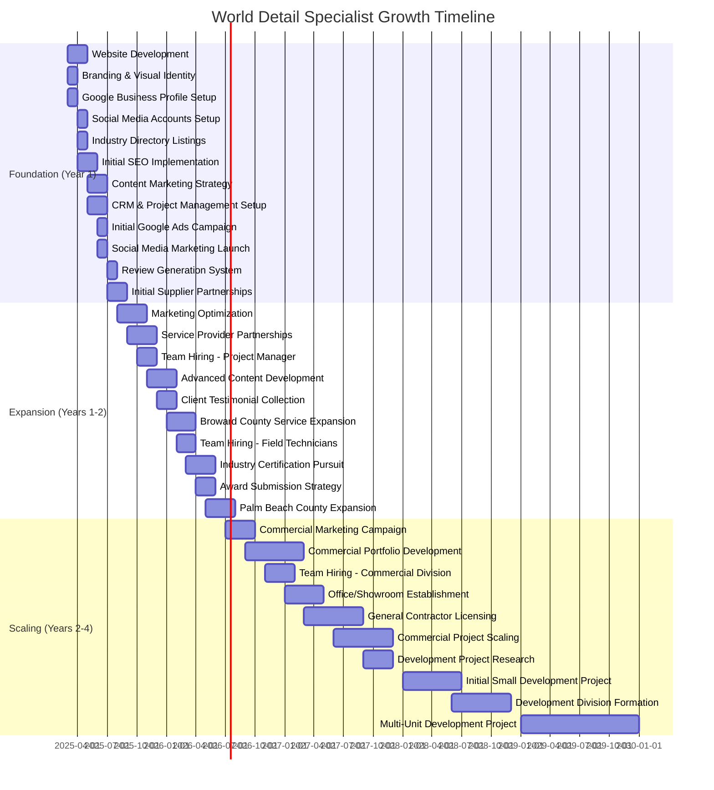

---

## 1. Digital Foundation: Website & Branding

A professional digital presence is not just about aesthetics—it's the cornerstone of your growth strategy, serving as your 24/7 salesperson and credibility builder.

### 1.1 Domain & Website Strategy

#### Why This Matters

Your website is often the first impression potential clients have of your business. In the construction industry, where projects involve significant investment, a professional website builds the trust necessary for clients to take the next step.

#### Action Plan

1. **Domain Registration**

   - Secure `worlddetailspecialist.com` through [Namecheap](https://www.namecheap.com) or [GoDaddy](https://www.godaddy.com)
   - Consider additional domains for service-specific landing pages (e.g., `miamikitchenremodel.com`)
   - Implementation Timeline: Immediate (Week 1)

2. **Website Development**
   - Create a mobile-responsive, SEO-optimized website with:
     - Portfolio showcase with filterable categories
     - Service pages with detailed descriptions and pricing guidance
     - Lead capture forms on every page
     - Client testimonial section with video testimonials
     - Blog section for content marketing
   - Recommended Platforms: [WordPress](https://wordpress.org) with Elementor or [Webflow](https://webflow.com)
   - Implementation Timeline: 4-6 weeks

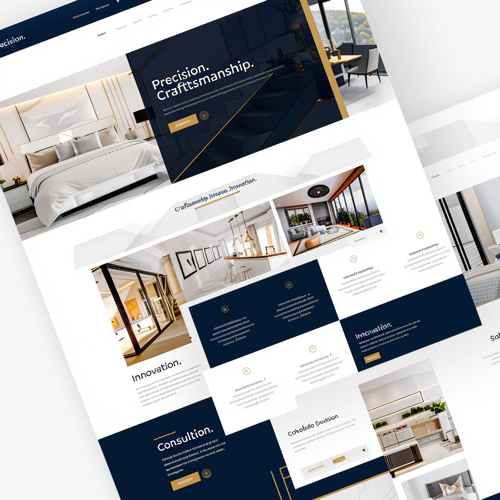

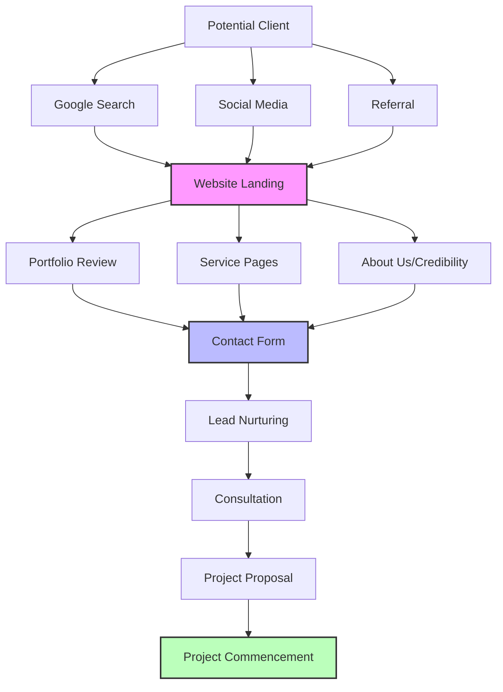

### 1.2 Branding & Visual Identity

#### Why This Matters

Consistent, professional branding differentiates you from competitors and creates recognition in a crowded market. For construction companies, branding that conveys reliability, quality, and attention to detail is essential.

#### Action Plan

1. **Logo & Visual Identity**

   - Develop a modern logo that communicates precision and craftsmanship
   - Create a comprehensive brand guide including:
     - Color palette (recommend blues/grays with accent colors)
     - Typography system
     - Image style guide
     - Voice and tone guidelines
   - Implementation Timeline: 2-3 weeks

2. **Marketing Materials**
   - Design templates for:
     - Digital proposals
     - Email signatures
     - Social media graphics
     - Presentation decks
   - Implementation Timeline: 2 weeks (following brand guide completion)

### 1.3 SEO & Local Search Optimization

#### Why This Matters

93% of online experiences begin with a search engine. For construction services, local SEO is particularly crucial as clients typically search for providers in their area. Ranking well for terms like "Miami kitchen remodeling" directly impacts lead generation.

#### Action Plan

1. **Keyword Research & Implementation**

   - Target primary keywords:
     - "Miami remodeling company"
     - "Kitchen renovation Miami"
     - "Commercial construction Miami"
     - "Bathroom remodeling South Florida"
   - Implement keywords in:
     - Page titles and meta descriptions
     - Header tags
     - URL structures
     - Image alt text
   - Implementation Timeline: Initial setup 2 weeks, ongoing optimization

2. **Google Business Profile Optimization**

   - Create and verify [Google Business Profile](https://business.google.com)
   - Add comprehensive business information, services, and high-quality images
   - Implement a review generation strategy (covered in Section 7)
   - Implementation Timeline: 1 week for setup, ongoing management

3. **Local Citation Building**
   - List business on key directories:
     - Yelp
     - Angie's List
     - HomeAdvisor
     - Houzz
     - Local chambers of commerce
   - Ensure NAP (Name, Address, Phone) consistency across all listings
   - Implementation Timeline: 3-4 weeks

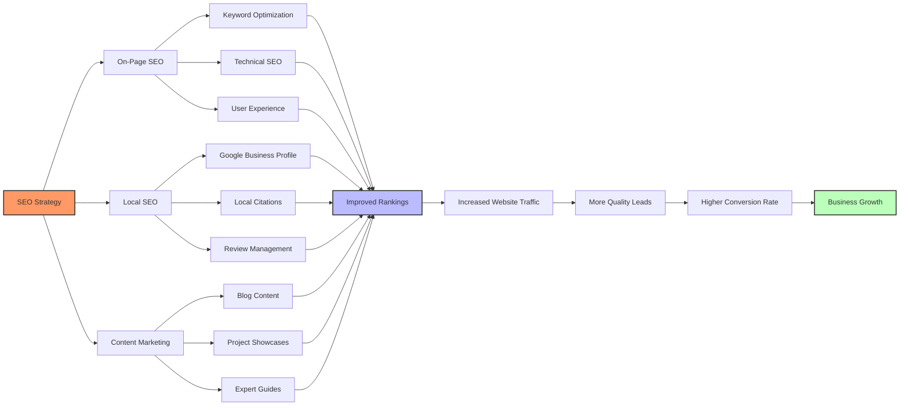

---

## 2. Digital Presence: Online Accounts & Directories

Establishing your business across key platforms creates multiple touchpoints for potential clients and strengthens your digital footprint.

### 2.1 Essential Business Accounts

#### Why This Matters

These platforms serve as trust signals for potential clients and improve your visibility in local searches. They also provide channels for showcasing your work and collecting valuable reviews.

#### Action Plan

1. **Google Business Profile**

   - Link: [business.google.com](https://business.google.com)
   - Benefits:
     - Appears in Google Maps and local search results
     - Allows clients to leave reviews
     - Provides insights on how clients find you
   - Key Setup Elements:
     - Verification process (typically postcard verification)
     - Complete all information fields
     - Add minimum 10 high-quality photos
     - Select appropriate business categories
   - Implementation Timeline: 1-2 weeks (including verification)

2. **Better Business Bureau (BBB)**

   - Link: [bbb.org](https://www.bbb.org)
   - Benefits:
     - Builds credibility and trust
     - Accreditation serves as a quality signal
     - Provides dispute resolution services
   - Implementation Timeline: 2-4 weeks for accreditation process

3. **Yelp Business Account**

   - Link: [biz.yelp.com](https://biz.yelp.com)
   - Benefits:
     - Popular platform for service business reviews
     - Opportunity to respond to customer feedback
     - Additional visibility in local searches
   - Implementation Timeline: 1 week

4. **Industry-Specific Platforms**
   - Houzz: [pro.houzz.com](https://pro.houzz.com)
   - HomeAdvisor: [pro.homeadvisor.com](https://pro.homeadvisor.com)
   - Thumbtack: [thumbtack.com/pro](https://www.thumbtack.com/pro)
   - Benefits:
     - Reach clients actively seeking construction services
     - Showcase portfolio to targeted audience
     - Gain industry credibility
   - Implementation Timeline: 2-3 weeks for all platforms

**[Image Description: A dashboard mockup showing the World Detail Specialist profile across multiple platforms (Google Business, Yelp, BBB, Houzz) with metrics for views, reviews, and engagement highlighted.]**

### 2.2 Strategic Social Media Presence

#### Why This Matters

For construction and remodeling businesses, visual platforms are particularly effective for showcasing work quality. Strategic social media presence builds brand awareness and provides social proof through engagement.

#### Action Plan

1. **Primary Platforms**

   - **Instagram**

     - Focus: Project transformations, behind-the-scenes, time-lapse videos
     - Posting Frequency: 3-4 times per week
     - Features to Utilize: Stories, Reels, Highlights for different service categories

   - **Facebook**

     - Focus: Longer content, client testimonials, community engagement
     - Posting Frequency: 2-3 times per week
     - Features to Utilize: Reviews, Events, Facebook Live for project reveals

   - **LinkedIn**
     - Focus: Commercial projects, industry insights, team achievements
     - Posting Frequency: 1-2 times per week
     - Features to Utilize: Articles, business networking, employee spotlights

2. **Content Strategy**
   - Before/After project showcases
   - Educational content about materials and processes
   - Client testimonial videos
   - Team spotlights and company culture
   - Local community involvement
   - Implementation Timeline: Ongoing, with content calendar developed in first 2 weeks

**[Image Description: A social media content calendar template for World Detail Specialist showing a month of planned posts across Instagram, Facebook, and LinkedIn with content types color-coded (e.g., project showcases, educational content, testimonials).]**

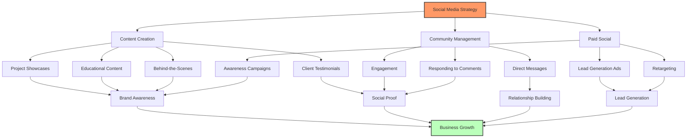

---

## 3. Marketing Ecosystem: Integrated Strategies

A balanced marketing approach combines organic growth with targeted paid strategies to create a consistent lead generation engine.

### 3.1 Organic Marketing Strategies

#### Why This Matters

Organic marketing builds sustainable, long-term growth and establishes your company as an authority in the industry. While it takes longer to show results than paid advertising, it typically delivers higher quality leads and better ROI over time.

#### Action Plan

1. **Content Marketing**

   - **Blog Strategy**

     - Topics:
       - Remodeling guides by room type
       - Material comparisons and selection advice
       - Project planning and budgeting tips
       - Local building code explanations
       - Seasonal maintenance guides
     - Frequency: 2-4 articles monthly
     - SEO Focus: Target long-tail keywords with lower competition

   - **Video Content**

     - Types:
       - Project walkthrough videos
       - Time-lapse construction footage
       - Client testimonials
       - Material and technique demonstrations
     - Platforms: YouTube, website, social media
     - Frequency: 1-2 videos monthly

   - **Lead Magnets**
     - Downloadable guides (e.g., "Miami Home Renovation Planning Guide")
     - Checklists (e.g., "Kitchen Remodel Preparation Checklist")
     - Budget calculators
     - Implementation Timeline: Develop 1 lead magnet per quarter

2. **Email Marketing**

   - **Segmented Lists**

     - Past clients
     - Prospects by project type
     - Prospects by location
     - Referral partners

   - **Campaign Types**

     - Monthly newsletter with recent projects and tips
     - Targeted campaigns for specific services
     - Seasonal promotions
     - Referral requests to past clients

   - **Platform Recommendation**: [Mailchimp](https://www.mailchimp.com) or [ActiveCampaign](https://www.activecampaign.com)
   - Implementation Timeline: Setup in first month, ongoing campaigns

**[Image Description: A content marketing funnel diagram showing how different content types (blog posts, videos, lead magnets, emails) move prospects through awareness, consideration, and decision stages, with example content for each stage in the construction industry.]**

### 3.2 Paid Marketing Strategies

#### Why This Matters

Paid marketing accelerates growth by putting your services in front of qualified prospects actively searching for solutions. For construction businesses, targeted paid strategies can deliver high-value leads quickly.

#### Action Plan

1. **Google Ads**

   - **Campaign Structure**

     - Search campaigns targeting high-intent keywords
     - Display remarketing to website visitors
     - YouTube video ads for brand awareness

   - **Key Search Terms**

     - "Miami kitchen remodeling contractor"
     - "Commercial construction Miami"
     - "Bathroom renovation near me"
     - "Best remodeling company South Florida"

   - **Budget Recommendation**: Start with $1,500-2,500/month, scale based on performance
   - Implementation Timeline: Setup in first month, ongoing optimization

2. **Social Media Advertising**

   - **Platform Focus**

     - Facebook/Instagram: Primary platforms for residential services
     - LinkedIn: Focus for commercial services

   - **Campaign Types**

     - Awareness campaigns with project showcases
     - Lead generation campaigns with special offers
     - Remarketing to website visitors

   - **Targeting Parameters**

     - Geographic: Miami-Dade, Broward, Palm Beach counties
     - Demographics: Homeowners, 35-65, income $100k+
     - Interests: Home improvement, interior design, real estate
     - For commercial: Target by industry and job title

   - **Budget Recommendation**: Start with $1,000-1,500/month
   - Implementation Timeline: Setup in first month, ongoing optimization

3. **Local Service Ads**
   - Google Guaranteed program for local service providers
   - Benefits: Prominent placement, pay-per-lead model, trust badge
   - Implementation Timeline: Apply within first quarter

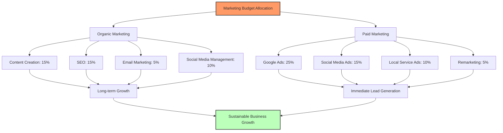

### 3.3 Tracking & Optimization

#### Why This Matters

Without proper tracking, marketing investments can be wasted. Implementing robust analytics allows you to identify what's working and optimize for better results.

#### Action Plan

1. **Analytics Setup**

   - Google Analytics 4 implementation
   - Google Tag Manager for event tracking
   - Call tracking with [CallRail](https://www.callrail.com)
   - Form submission tracking
   - Implementation Timeline: First month

2. **Key Performance Indicators (KPIs)**

   - Cost per lead by channel
   - Lead-to-consultation conversion rate
   - Consultation-to-project conversion rate
   - Customer acquisition cost
   - Return on ad spend
   - Implementation Timeline: Reporting dashboard setup in first month

3. **Regular Optimization**
   - Weekly: Ad performance review and adjustment
   - Monthly: Comprehensive marketing performance review
   - Quarterly: Strategy adjustment based on data
   - Implementation Timeline: Ongoing

**[Image Description: A marketing analytics dashboard mockup showing key metrics for World Detail Specialist including lead sources, conversion rates, cost per acquisition, and ROI by marketing channel with month-over-month comparisons.]**

---

## 4. Physical Assets & Brand Touchpoints

Physical materials reinforce your brand and create professional touchpoints throughout the customer journey.

### 4.1 Essential Physical Materials

#### Why This Matters

In the construction industry, physical materials serve both marketing and operational purposes. They reinforce your brand at job sites, during client meetings, and in the community.

#### Action Plan

1. **Business Cards**

   - Premium quality with your logo, contact information, and website
   - Consider unique features like textured paper, spot UV, or metal cards for high-end clients
   - Quantity: 500-1,000 initially
   - Provider: [MOO](https://www.moo.com) or [Vistaprint](https://www.vistaprint.com)
   - Implementation Timeline: Design and order in first month

2. **Job Site Signage**

   - Yard signs for residential projects
   - Larger banners for commercial projects
   - Include logo, website, phone number, and "Now Working With" or "Another Quality Project By"
   - Quantity: 10-20 yard signs, 2-3 banners initially
   - Implementation Timeline: Design and order in first month

3. **Vehicle Branding**

   - Magnetic door signs or partial wraps for company vehicles
   - Include logo, website, phone number, and key services
   - Implementation Timeline: Design in first month, production in second month

4. **Branded Apparel**

   - Polo shirts and t-shirts with embroidered logo for team members
   - Safety vests with printed logo for job sites
   - Implementation Timeline: Design and order in second month

5. **Client Presentation Materials**
   - Professional folders for proposals and contracts
   - Leave-behind materials with portfolio highlights
   - Implementation Timeline: Design and order in second month

**[Image Description: A collection of branded materials for World Detail Specialist including business cards, job site signs, vehicle magnets, and branded apparel arranged in a professional flat lay composition.]**

### 4.2 Technology & Equipment

#### Why This Matters

Modern technology improves client experience, streamlines operations, and projects professionalism. For construction businesses, the right technology can be a significant differentiator.

#### Action Plan

1. **Field Technology**

   - iPad or tablet for on-site estimates, contracts, and presentations
   - Recommendation: iPad Pro 12.9" with cellular connectivity
   - Protective case suitable for construction environments
   - Implementation Timeline: Purchase in first month

2. **Photography Equipment**

   - Quality camera for project documentation
   - Recommendation: Sony Alpha or Canon EOS series
   - Wide-angle lens for interior shots
   - Tripod and lighting kit
   - Implementation Timeline: Purchase in second month

3. **Measurement Tools**

   - Laser measurement devices for accurate estimates
   - 3D scanning capabilities for complex spaces
   - Implementation Timeline: Purchase in second month

4. **Communication Equipment**
   - Dedicated business phone line
   - Options:
     - [Google Voice](https://voice.google.com): $10/month
     - [Grasshopper](https://grasshopper.com): $26/month
     - [RingCentral](https://www.ringcentral.com): $30+/month
   - Implementation Timeline: Setup in first month

**[Image Description: A workspace setup showing the essential technology for World Detail Specialist including an iPad with estimation software open, a professional camera with wide-angle lens, laser measurement tools, and a smartphone with business line apps.]**

---

## 5. Operational Systems & Software

Implementing the right software stack creates operational efficiency and enhances client experience.

### 5.1 Core Business Systems

#### Why This Matters

Efficient operations allow you to scale without proportionally increasing overhead. The right software tools automate repetitive tasks, reduce errors, and provide better client experiences.

#### Action Plan

1. **Customer Relationship Management (CRM)**

   - **Recommendations**:

     - Construction-specific: [Buildertrend](https://buildertrend.com) or [CoConstruct](https://www.coconstruct.com)
     - General: [HubSpot](https://www.hubspot.com) or [Pipedrive](https://www.pipedrive.com)

   - **Key Features Needed**:

     - Lead tracking and management
     - Project pipeline visualization
     - Email integration
     - Mobile access
     - Document storage

   - **Implementation Timeline**: Selection in first month, setup and training in second month

2. **Project Management**

   - **Recommendations**:

     - Construction-specific: [Buildertrend](https://buildertrend.com) or [Procore](https://www.procore.com)
     - General: [Asana](https://asana.com) or [Monday.com](https://monday.com)

   - **Key Features Needed**:

     - Task assignment and tracking
     - Project scheduling
     - Client communication portal
     - File sharing
     - Mobile access for field updates

   - **Implementation Timeline**: Selection in first month, setup and training in second month

3. **Accounting & Financial Management**

   - **Recommendations**:

     - [QuickBooks](https://quickbooks.intuit.com)
     - [Xero](https://www.xero.com)

   - **Key Features Needed**:

     - Invoicing and payment processing
     - Expense tracking
     - Financial reporting
     - Tax preparation
     - Payroll (if applicable)

   - **Implementation Timeline**: Setup in first month

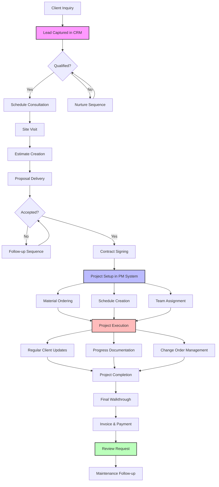

### 5.2 Specialized Construction Tools

#### Why This Matters

Industry-specific tools improve estimation accuracy, project visualization, and client communication—all critical factors in winning and executing profitable projects.

#### Action Plan

1. **Estimation Software**

   - **Recommendations**:

     - [Clear Estimates](https://www.clearestimates.com)
     - [PlanSwift](https://www.planswift.com)

   - **Benefits**:

     - Accurate material takeoffs
     - Professional proposal generation
     - Profit margin calculation
     - Template creation for common projects

   - **Implementation Timeline**: Selection and setup in second month

2. **Design Visualization Tools**

   - **Recommendations**:

     - [SketchUp](https://www.sketchup.com)
     - [Houzz Pro](https://pro.houzz.com)
     - [Cedreo](https://cedreo.com)

   - **Benefits**:

     - 3D visualization for client presentations
     - Improved client understanding of proposed changes
     - Reduced change orders during construction
     - Competitive advantage in proposals

   - **Implementation Timeline**: Selection and training in third month

3. **Document Management**

   - **Recommendations**:

     - [Procore](https://www.procore.com)
     - [PlanGrid](https://www.plangrid.com)

   - **Benefits**:

     - Centralized storage for plans and specifications
     - Mobile access to documents in the field
     - Version control for revisions
     - Reduced errors from outdated information

   - **Implementation Timeline**: Selection and setup in third month

**[Image Description: A split-screen mockup showing a before/after kitchen renovation with the left side showing a 3D rendering created in design software and the right side showing the completed project that matches the rendering, demonstrating the value of visualization tools.]**

---

## 6. Strategic Partnerships & Network Development

Building strategic relationships creates new business opportunities and enhances your service offerings.

### 6.1 Key Partnership Categories

#### Why This Matters

Strategic partnerships extend your capabilities, provide referral sources, and create opportunities for larger projects. In construction, the right partnerships can significantly accelerate growth.

#### Action Plan

1. **Material Suppliers & Vendors**

   - **Target Partners**:

     - Kitchen and bath suppliers
     - Flooring distributors
     - Lighting specialists
     - Custom cabinetry fabricators
     - Countertop manufacturers

   - **Benefits**:

     - Preferential pricing
     - Early access to new products
     - Showroom referrals
     - Co-marketing opportunities

   - **Development Strategy**:

     - Schedule introductory meetings with key suppliers
     - Negotiate volume-based discounts
     - Establish reliable delivery schedules
     - Create showroom displays featuring your work

   - **Implementation Timeline**: Begin outreach in first month, establish 3-5 key partnerships in first quarter

2. **Complementary Service Providers**

   - **Target Partners**:

     - Architects and designers
     - Real estate agents
     - Property managers
     - Home inspectors
     - Landscaping companies

   - **Benefits**:

     - Referral exchange
     - Bundled service offerings
     - Expanded project scope

   - **Development Strategy**:

     - Join industry networking groups
     - Establish formal referral programs
     - Host collaborative events
     - Create co-branded marketing materials

   - **Implementation Timeline**: Begin networking in first month, establish 5-7 partnerships by end of second quarter

3. **Industry Associations**

   - **Recommended Organizations**:

     - [National Association of Home Builders](https://www.nahb.org)
     - [National Kitchen & Bath Association](https://nkba.org)
     - [Associated Builders and Contractors](https://www.abc.org)
     - Local builders associations and chambers of commerce

   - **Benefits**:

     - Credibility and certifications
     - Educational opportunities
     - Networking events
     - Industry updates and resources

   - **Implementation Timeline**: Join 2-3 key associations in first quarter

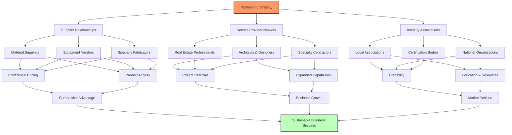

### 6.2 Partnership Development Strategy

#### Action Plan

1. **Networking Events**

   - Attend minimum 2 industry events monthly
   - Host quarterly open house or appreciation events
   - Implementation Timeline: Begin in first month, ongoing

2. **Referral Program**

   - Develop structured referral incentives
   - Create tracking system for referral sources
   - Implement regular appreciation for referral partners
   - Implementation Timeline: Develop in second month, launch in third month

3. **Co-Marketing Initiatives**
   - Joint social media campaigns with complementary businesses
   - Collaborative content creation (e.g., kitchen design guide with an interior designer)
   - Shared booth presence at home shows
   - Implementation Timeline: First initiative in second quarter

**[Image Description: A networking event scene showing World Detail Specialist team members engaging with potential partners in a professional setting, with business cards and project portfolios visible on display tables.]**

---

## 7. Trust Building & Reputation Management

In the construction industry, trust is your most valuable asset. A systematic approach to reputation management accelerates growth and attracts higher-value clients.

### 7.1 Review Generation System

#### Why This Matters

92% of consumers read online reviews before making purchase decisions, and this percentage is even higher for significant investments like construction projects. A strong review profile directly impacts conversion rates.

#### Action Plan

1. **Systematic Review Collection**

   - Implement a post-project review request process
   - Use automated email sequences at project completion
   - Follow up with personal calls for high-value clients
   - Provide simple instructions and direct links to review platforms
   - Implementation Timeline: Setup in first month

2. **Review Management Platform**

   - **Recommendations**:

     - [Podium](https://www.podium.com)
     - [GatherUp](https://gatherup.com)
     - [NiceJob](https://get.nicejob.com)

   - **Benefits**:

     - Centralized review collection
     - Review monitoring across platforms
     - Response management
     - Review widgets for website

   - **Implementation Timeline**: Setup in second month

3. **Review Response Strategy**
   - Respond to all reviews within 24-48 hours
   - Express gratitude for positive reviews
   - Address negative reviews professionally and offer solutions
   - Implementation Timeline: Ongoing

**[Image Description: A screenshot of a review management dashboard showing World Detail Specialist's ratings across multiple platforms (Google, Yelp, Houzz) with recent reviews displayed and a "Request Review" interface that shows how easy the process is for clients.]**

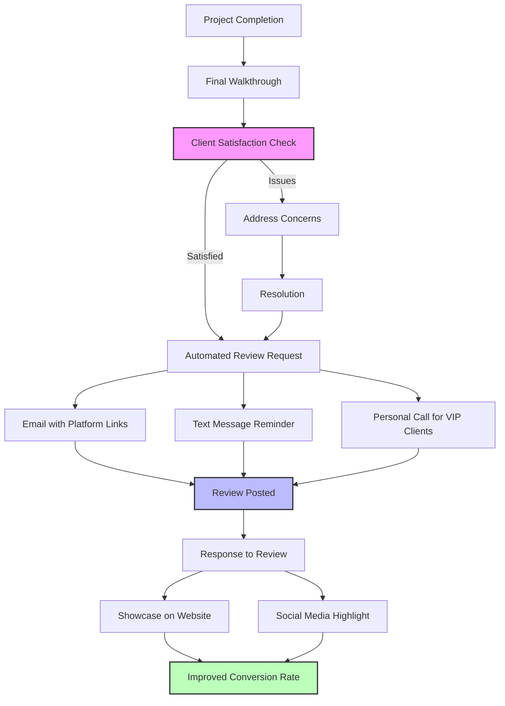

### 7.2 Trust-Building Content

#### Why This Matters

Beyond reviews, potential clients seek evidence of expertise, reliability, and transparency. Strategic content builds trust and positions your company as an authority in the construction industry.

#### Action Plan

1. **Case Studies & Portfolio**

   - Create detailed case studies for each service category
   - Include:
     - Client challenges and goals
     - Your solution and approach
     - Before/after imagery
     - Budget considerations
     - Timeline adherence
     - Client testimonials
   - Implementation Timeline: Develop 1-2 case studies monthly

2. **Transparency Content**

   - **Topics**:

     - "Our Process" detailed explanation
     - "What to Expect" guides for different project types
     - Pricing guidance and budget considerations
     - FAQ section addressing common concerns

   - **Benefits**:

     - Sets realistic expectations
     - Demonstrates professionalism
     - Reduces client anxiety
     - Pre-qualifies prospects

   - Implementation Timeline: Develop in first quarter

3. **Team & Company Story**
   - Feature team members with bios and credentials
   - Share company history and values
   - Highlight community involvement
   - Implementation Timeline: Develop in first month

**[Image Description: A professional case study layout for a World Detail Specialist kitchen renovation project showing before/after photos, client testimonial, project timeline visualization, and key features of the completed project with elegant typography and branded design elements.]**

### 7.3 Credentials & Social Proof

#### Why This Matters

Formal credentials and third-party validation significantly impact trust, particularly for larger commercial projects and high-end residential work.

#### Action Plan

1. **Industry Certifications**

   - Pursue relevant certifications:
     - General Contractor License
     - NARI Certified Remodeler
     - EPA Lead-Safe Certification
     - OSHA Safety Certifications
   - Display credentials prominently on website and marketing materials
   - Implementation Timeline: Begin certification process in first quarter

2. **Awards & Recognition**

   - Submit completed projects to industry award programs:
     - NARI Contractor of the Year Awards
     - Houzz Best of Service
     - Local business awards
   - Implementation Timeline: First submissions in second quarter

3. **Media Features**
   - Develop relationships with local home and design publications
   - Pitch completed projects for features
   - Offer expert commentary on remodeling trends
   - Implementation Timeline: Begin outreach in second quarter

**[Image Description: A trust-building section from the World Detail Specialist website showing industry certifications with logos, award badges, and media feature logos arranged in a clean, professional layout that conveys credibility at a glance.]**

---

## 8. Implementation Roadmap & Success Metrics

A structured implementation approach with clear metrics ensures steady progress toward your growth goals.

### 8.1 Phased Implementation Plan

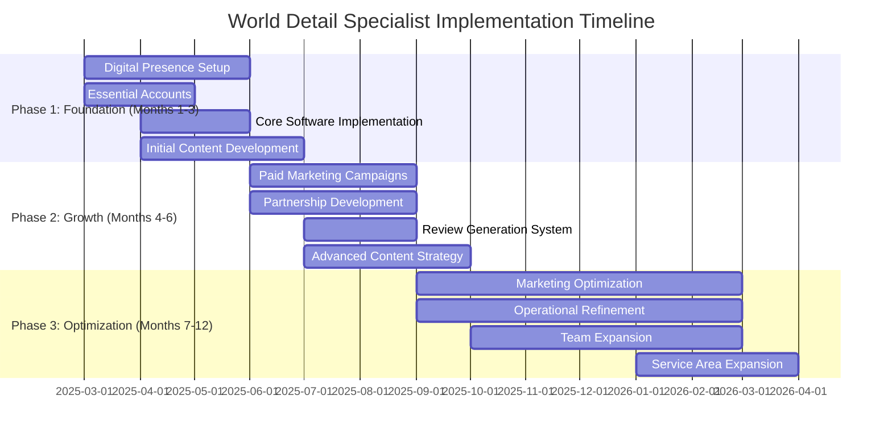

### 8.2 Key Performance Indicators

#### Digital Presence Metrics

- Website traffic growth (target: 30% increase quarterly)
- Organic search rankings for target keywords
- Social media engagement and follower growth
- Google Business Profile views and actions

#### Lead Generation Metrics

- Monthly qualified leads (target: 30+ by month 6)
- Lead source distribution
- Cost per lead by channel
- Lead-to-consultation conversion rate (target: 40%+)

#### Business Growth Metrics

- Project volume (target: 50% increase in year 1)
- Average project value
- Client acquisition cost
- Revenue growth
- Profit margin

#### Reputation Metrics

- Review volume and average rating
- Referral rate
- Repeat client percentage

**[Image Description: A business dashboard mockup showing World Detail Specialist's key performance metrics with graphs tracking growth over time, color-coded status indicators, and comparison to targets. The dashboard has sections for digital metrics, lead generation, projects, and financial performance.]**

### 8.3 Quarterly Review Process

To ensure the growth plan stays on track and adapts to changing conditions, implement a quarterly review process:

1. **Comprehensive Metrics Review**

   - Analyze all KPIs against targets
   - Identify trends and patterns
   - Document successes and challenges

2. **Strategy Adjustment**

   - Reallocate resources based on performance
   - Refine targeting and messaging
   - Adjust timelines as needed

3. **Next Quarter Planning**
   - Set specific goals for the coming quarter
   - Assign responsibilities
   - Update implementation timeline

**[Image Description: A quarterly business review meeting scene showing World Detail Specialist team members analyzing performance data on a large screen, with printed reports and planning materials visible on the conference table.]**

---

## 9. Conclusion: Your Path to Sustainable Growth

This comprehensive growth plan provides World Detail Specialist with a clear roadmap to achieve your ambitious vision. By implementing these strategies in a systematic, phased approach, you'll build a strong foundation for sustainable growth that supports your short, mid, and long-term objectives.

### Key Success Factors

1. **Consistent Implementation**

   - Follow the phased approach
   - Maintain momentum even when results aren't immediate
   - Allocate adequate resources to each initiative

2. **Data-Driven Decisions**

   - Use analytics to guide strategy adjustments
   - Test and measure before scaling
   - Identify and double down on what works

3. **Quality Focus**

   - Maintain your commitment to craftsmanship as you grow
   - Use systems and processes to ensure consistency
   - Let your work quality drive your reputation

4. **Adaptability**
   - Remain flexible as market conditions change
   - Stay current with industry trends
   - Continuously refine your approach based on results

By executing this plan, World Detail Specialist will transform from a growing contractor into a dominant force in the South Florida construction and remodeling market. Your digital presence will generate a consistent flow of qualified leads, your operational systems will support efficient scaling, and your reputation will open doors to increasingly prestigious projects.

The journey from where you are today to "building the first house on the moon" begins with these strategic steps—each one bringing you closer to your ultimate vision of becoming an innovative leader in construction and development.

**[Image Description: An aspirational closing image showing a modern, innovative building with distinctive architectural features and the World Detail Specialist logo subtly integrated. The image conveys the company's future vision of tackling increasingly ambitious and prestigious projects.]**
